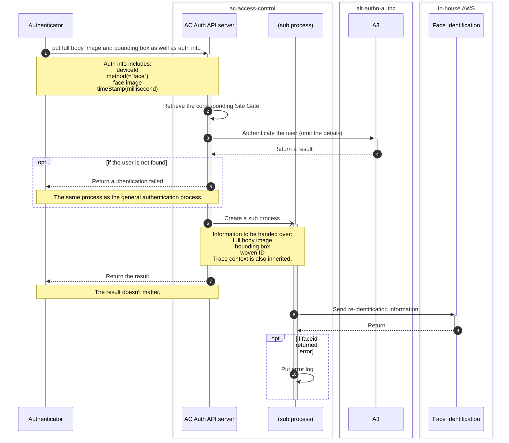

# Re-identification sequence

What is re-identification?
=> see [`Note` section of this ticket](https://jira.tri-ad.tech/browse/CISAM-4159).

## Assumptions

- The authentication process follows the general door authentication process.
- This process is performed only when the authentication method is face authentication.
- The target facility is `Site Gate`.

## Sequence

