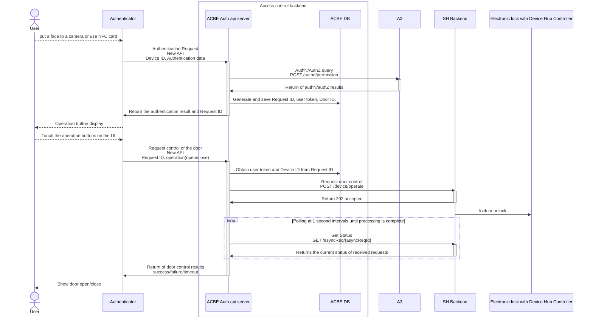

# Smart Home Linkage Sequence

## Table of Contents <!-- omit in toc -->

- [Smart Home Linkage Sequence](#smart-home-linkage-sequence)
  - [Overview Architecture](#overview-architecture)
  - [Glossary](#glossary)
  - [Scenarios](#scenarios)
    - [Smart Home Linked Door Control Sequence](#smart-home-linked-door-control-sequence)

This document describes the main use case scenarios of AC Management Service with their sequences.

## Overview Architecture

See this [figma](https://www.figma.com/file/T0H41djRWelPhaF6zyHTSD/Access-Control---Smart-Home-door-lock-integration?type=whiteboard&node-id=1-546&t=6ISPB73njOOg2Hfp-0).

## Glossary

| Word                  | Description |
| --------------------- | ----------- |
| Authenticator         | Authentication machine to be installed near the door. |
| ACBE Auth api server  | An API server in Access Control Backend. |
| A3                    | Services that provide authentication and authorization capabilities. |
| Device Hub Controller | Device control equipment controlled by Smart Home service. |

## Scenarios

This section describes the main use cases with their sequences.

### Smart Home Linked Door Control Sequence

Authentication authorization and door control are performed by separate APIs
When the authentication authorization request is successful, ACBE issues and returns a request ID, and the door control API identifies the device ID based on that ID.

