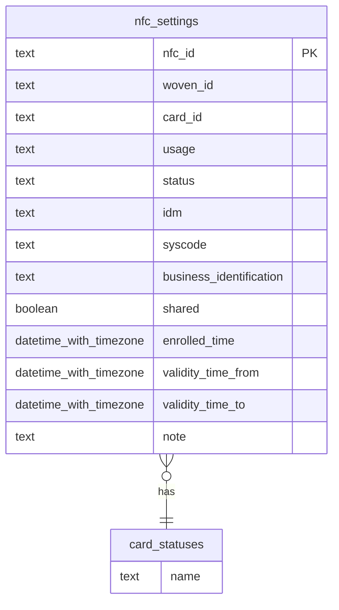

# Data Design <!-- omit in toc -->

This document describes the design of data handled by NFC manager.
This document contains the following definitions.

- database definitions for Postgres cluster

## NFC manager DB

The NFC manager database stores NFC ID, Woven ID, and NFC card association settings.

Database: Postgres cluster

### List of Tables

#### List of Enum Tables

Each table stores the list of specific enum values.

| Table name    |
| :------------ |
| card_statuses |

#### List of Master Tables

These tables store the metadata and the relationships between them.

| Table name   |
| :----------- |
| nfc_settings |

### Table Relationships

The following image shows the relationships between tables.

### Table Schema

#### Enum Tables

This section describes the definitions of enum tables.
In enum tables, records are expected to be inserted initially, and not expected to be updated.
Each table has the following schema.

| Column name | Type | PK   | FK   | Nullable | Description |
| :---------- | :--- | :--- | :--- | :------- | :---------- |
| name        | text | o    |      |          |             |

##### card_statuses

This table stores a list of NFC card statuses.
values:

- lending
- returned
- lost
- invalid

#### user_groups

This table store A3 User Groups to be assigned to the Shared card.

| Column name | Type | PK   | FK   | Nullable | Description                                          |
| :---------- | :--- | :--- | :--- | :------- | :--------------------------------------------------- |
| name        | text | o    |      |          | A3 user group name                                   |
| note        | text |      |      |          | note additional information of describing this group |

#### nfc_settings

| Column name             | Type                   | PK   | FK                  | Nullable | Description                                               |
| :---------------------- | :--------------------- | :--- | :------------------ | :------- | :-------------------------------------------------------- |
| nfc_id                  | text                   | o    |                     |          | NFC ID                                                    |
| woven_id                | text                   |      |                     |          | Woven ID associated with NFC ID                           |
| card_id                 | text                   |      |                     |          | number printed on the surface of NFC card                 |
| status                  | text                   |      | card_statuses(name) |          | current status of NFC card                                |
| idm                     | text                   |      |                     |          | identifier already written on the NFC card                |
| syscode                 | text                   |      |                     |          | identification code assigned to a company                 |
| business_identification | text                   |      |                     |          | free description to be used with shared card              |
| user_group              | text                   |      | user_groups(name)   | o        | A3 user group to which the shared card belongs            |
| shared                  | boolean                |      |                     |          | whether the card type is shared or personal               |
| enrolled_time           | datetime with timezone |      |                     |          | datetime with timezone that the NFC card is enrolled      |
| validity_time_from      | datetime with timezone |      |                     | o        | datetime with timezone of start of NFC card validity time |
| validity_time_to        | datetime with timezone |      |                     | o        | datetime with timezone of end of NFC card validity time   |

- Unique constraint: card_id and idm, respectively.

## NFC Manager Log DB

The NFC Log database stores NFC manager logs.

Database: Secure KVS
Database Name: nfc-manager-logs  
(The actual database name is namespace + database name, which is `ac-access-control_nfc-manager-logs`.)

### Document schema - common fields

These fields are common across log types.

| Field name   | Type         | Description                                       |
| :----------- | :----------- | :------------------------------------------------ |
| +logType     | string(enum) | Log type of the document.                         |
| +requestId   | string       | A value of `X-Request-ID` in the request.         |
| +operatorId  | string       | Woven ID of the user who performed the operation. |
| +timestampMs | number       | Timestamp when the log is stored.                 |

#### `logType` enum values

- NFCManagement
- NFCVerification

### Document schema - NFC management

This type of document tracks the revision history of each NFC card.

| Field name     | Type         | Description                                                                                                                |
| :------------- | :----------- | :------------------------------------------------------------------------------------------------------------------------- |
| +nfcId         | string       | NFC ID to be operated.                                                                                                     |
| +cardId        | string       | Card ID to be operated.                                                                                                    |
| +operationType | string(enum) | Details of the operation performed.                                                                                        |
| body           | object       | This field contains raw request bodies of the request. PII values will be masked, or not be included (no such fields now). |

#### `operationType` enum values

- CreateNFC
- DeleteNFC
- UpdateNFC
- UpdateNFCStatus

### Document schema - NFC verification

This type of document records NFC ID verification requests.
TBD.

### How to generate DocID

Need to set unique DocID when writing logs in SecureKVS.
Set `logType` + "_" + `Timestamp(Nano)` + "_" + {[0-9a-zA-Z]{4}} as DocID.
example: `NFCManagement_1691627932000000000_Az09`
