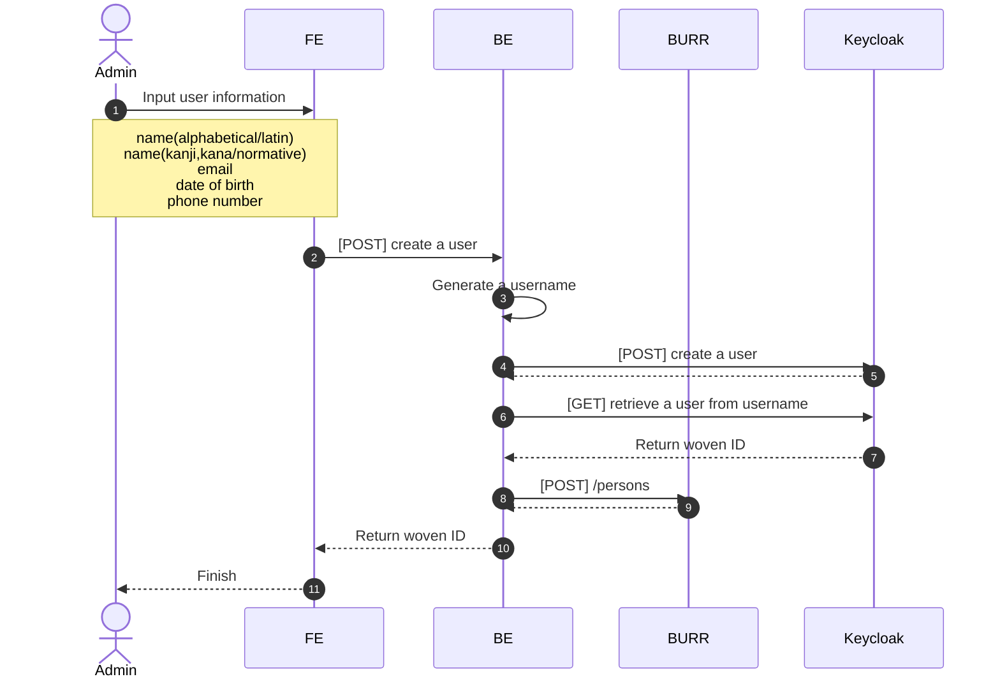
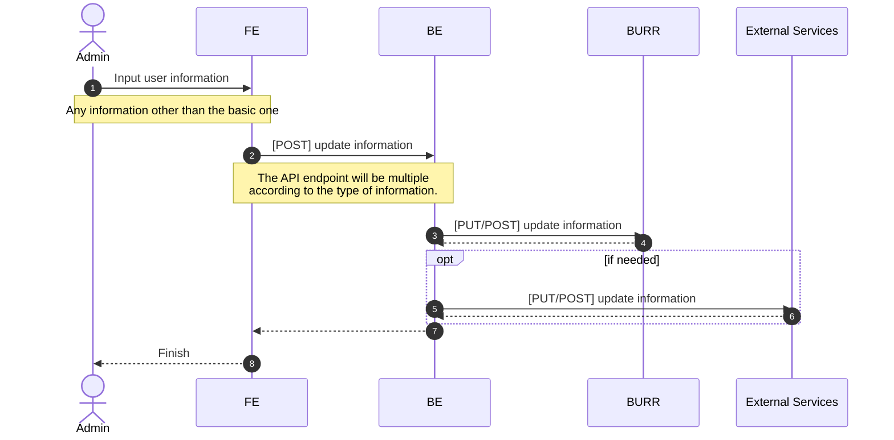
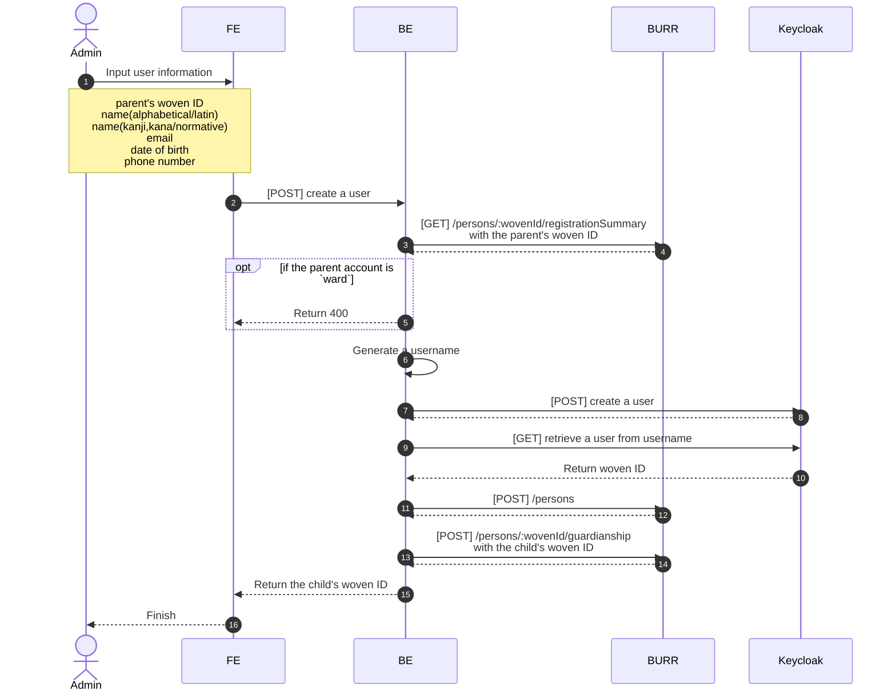
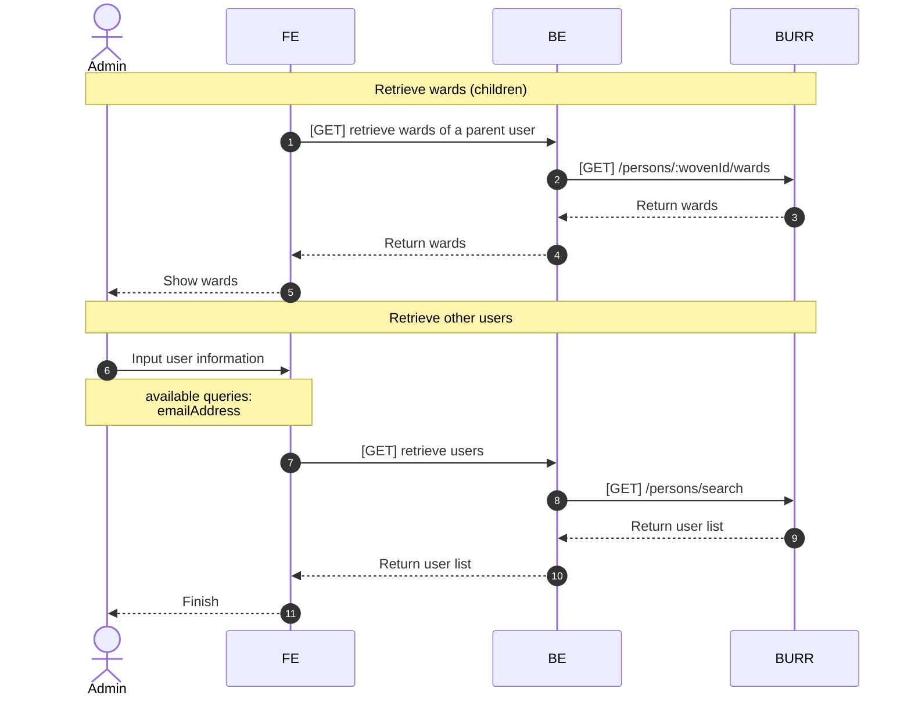
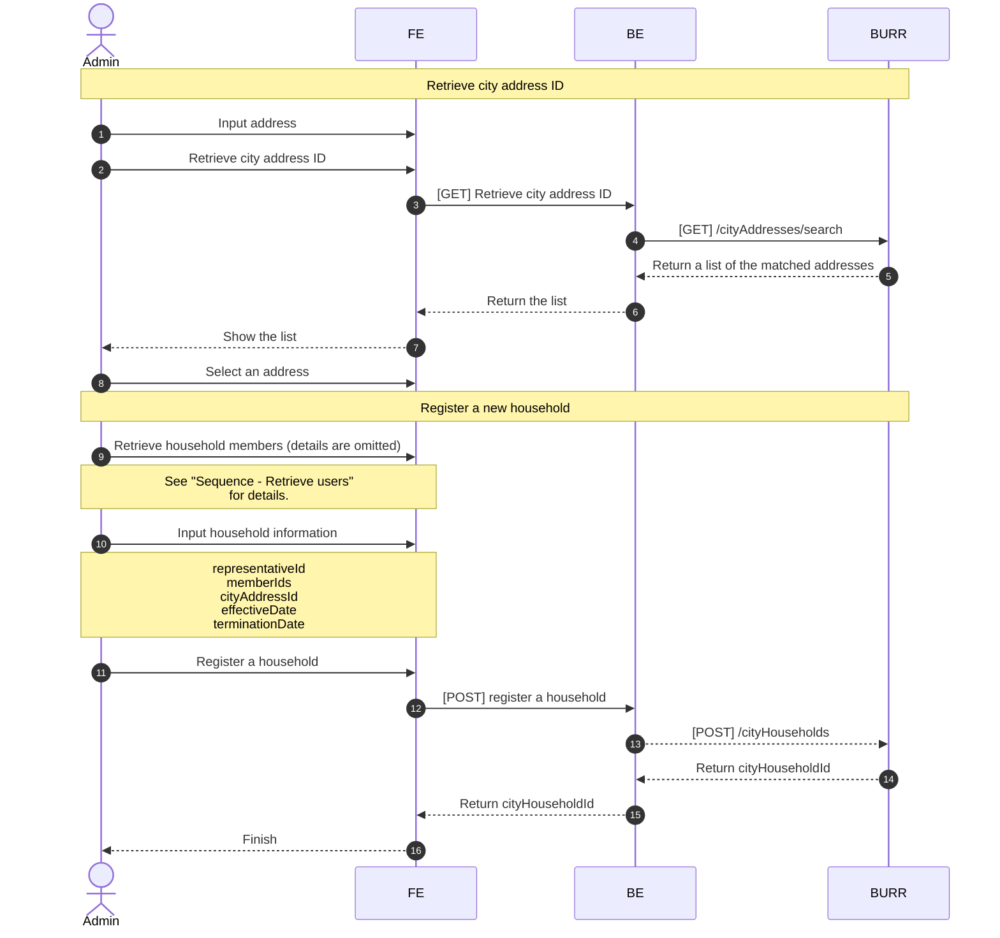
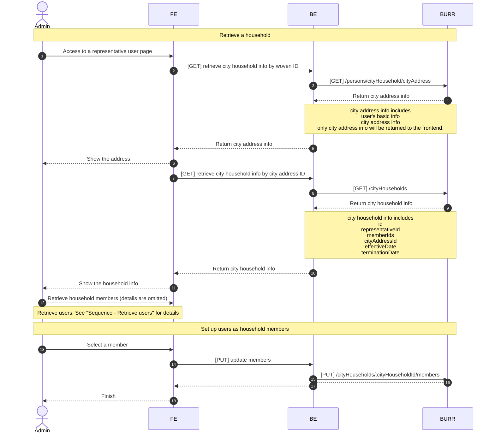

# Resident Registration System Design

- [Resident Registration System Design](#resident-registration-system-design)
  - [Overview](#overview)
    - [Prerequisites](#prerequisites)
    - [Overview process](#overview-process)
  - [Sequence Diagrams](#sequence-diagrams)
    - [Sequence - Create a new account](#sequence---create-a-new-account)
    - [Sequence - Update other information on a user](#sequence---update-other-information-on-a-user)
    - [Sequence - Register new account and associate with a parent user](#sequence---register-new-account-and-associate-with-a-parent-user)
    - [Sequence - Retrieve users](#sequence---retrieve-users)
    - [Sequence - Set up a household and its members](#sequence---set-up-a-household-and-its-members)
    - [Sequence - Set up additional users as household members](#sequence---set-up-additional-users-as-household-members)

## Overview

### Prerequisites

The application will be used by administrative users.

### Overview process

The entier process is as listed.

- Register a user
  - Create a new account
  - Update other information on a user
- Register a child
  - Create a new account and associate with a parent user
- Set up a household
  - Retrieve users
  - Set up a household and its members
  - Set up additional users as household members

## Sequence Diagrams

TBD: Retry policies of sequential HTTP requests in a request.

### Sequence - Create a new account

~~*Discussion*: Is the `username` given or should the backend generate it?~~
=> The backend generates it to prevent users from conflicting usernames.

### Sequence - Update other information on a user

This is an abstract sequence of how the application updates information other than the basic one.

~~**Discussion**: How the application (FE&BE) handle the situation when some update requests partially fail?~~=>Simply handle it by admins' retrial.

### Sequence - Register new account and associate with a parent user

### Sequence - Retrieve users

### Sequence - Set up a household and its members

### Sequence - Set up additional users as household members

