# Visitor Registration System Design

- [Visitor Registration System Design](#visitor-registration-system-design)
  - [Overview](#overview)
  - [Data Flow Diagram](#data-flow-diagram)
    - [DFD - Create an account to Woven ID](#dfd---create-an-account-to-woven-id)
    - [DFD - Register user information (pre-registration method)](#dfd---register-user-information-pre-registration-method)
      - [Before eKYC](#before-ekyc)
      - [After eKYC](#after-ekyc)
    - [DFD - Identity verification (pre-registration method)](#dfd---identity-verification-pre-registration-method)
    - [DFD - Register user information (children)](#dfd---register-user-information-children)
    - [DFD - Registration of traffic course completion](#dfd---registration-of-traffic-course-completion)
  - [State Transition Diagram](#state-transition-diagram)
    - [State - Register user information and identity verification (pre-registration method)](#state---register-user-information-and-identity-verification-pre-registration-method)
    - [State - Create a child account](#state---create-a-child-account)
  - [Sequence Diagram](#sequence-diagram)
    - [Sequence - Register user information (pre-registration method)](#sequence---register-user-information-pre-registration-method)
    - [Sequence - Identity verification (pre-registration method)](#sequence---identity-verification-pre-registration-method)
      - [Access to the application page - complete application (not yet verified)](#access-to-the-application-page---complete-application-not-yet-verified)
      - [Get verification result - Update status](#get-verification-result---update-status)
    - [Sequence - Register additional personal information and face image](#sequence---register-additional-personal-information-and-face-image)
    - [Sequence - Register children](#sequence---register-children)
      - [Sequence - Create a child account](#sequence---create-a-child-account)
    - [Sequence - Registration of traffic course completion](#sequence---registration-of-traffic-course-completion)

## Overview

The entire process is as listed.

- Create a new woven ID
  - see the corresponding sequence in [this confluence page](https://confluence.tri-ad.tech/display/CISAM/Visitor+Registration+Sequence+for+adult+normal+case#VisitorRegistrationSequenceforadultnormalcase-LoginorcreateanaccounttoWovenID)
- Register user information (pre-registration)
- Identity verification (pre-registration)
- Register additional personal information and face image
- Register children
- Registration of traffic course completion

## Data Flow Diagram

### DFD - Create an account to Woven ID

- TBD: Other information to be stored in BURR
- TBD: KeyCloak may create a new record to BURR

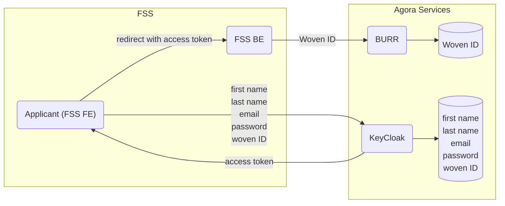

### DFD - Register user information (pre-registration method)

#### Before eKYC

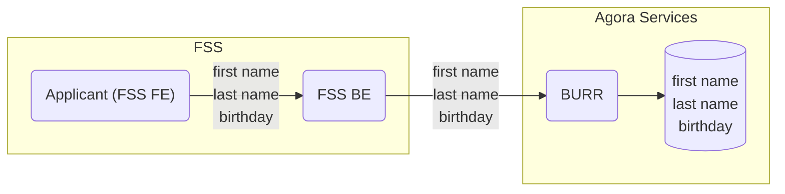

#### After eKYC

The backend will register a front face image taken during eKYC to Face Identifier.
In this phase, the backend requests another face image if the registration above fails.

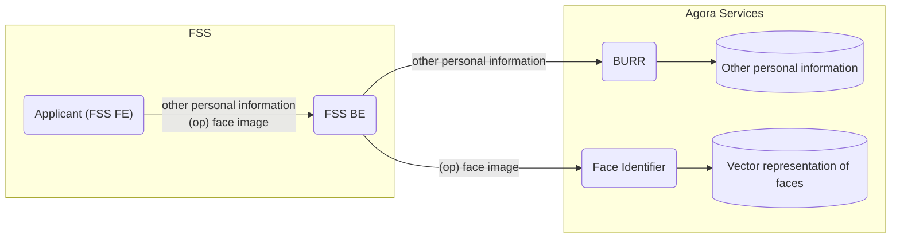

### DFD - Identity verification (pre-registration method)

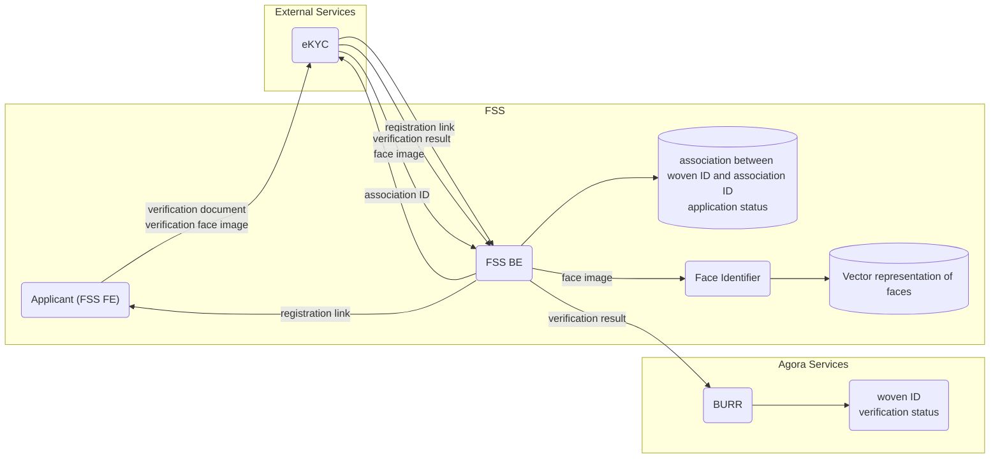

### DFD - Register user information (children)

- TBD: KeyCloak may create a new record to BURR

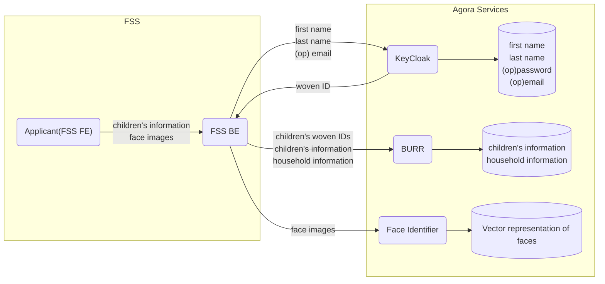

### DFD - Registration of traffic course completion

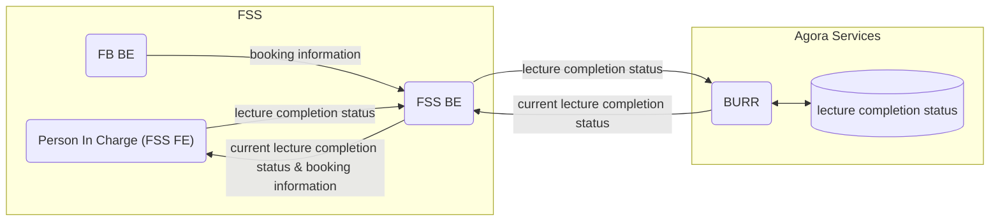

## State Transition Diagram

### State - Register user information and identity verification (pre-registration method)

Each state is associated with an applicant's woven ID.

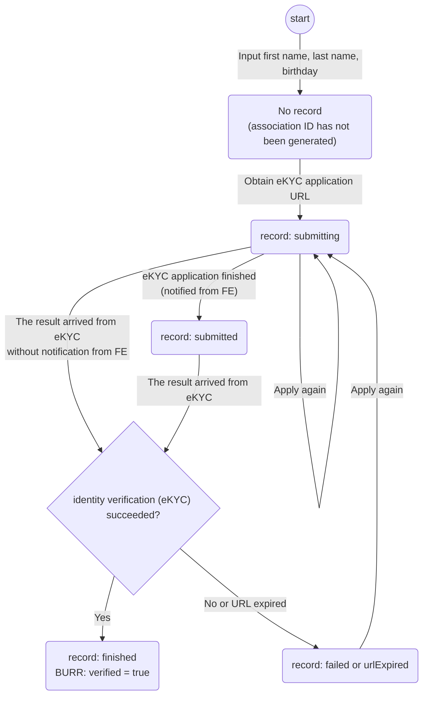

### State - Create a child account

This state transition diagram shows the backend one during child account creation process.  
Each state is associated with an applicant's woven ID and a registration ID generated on the process.

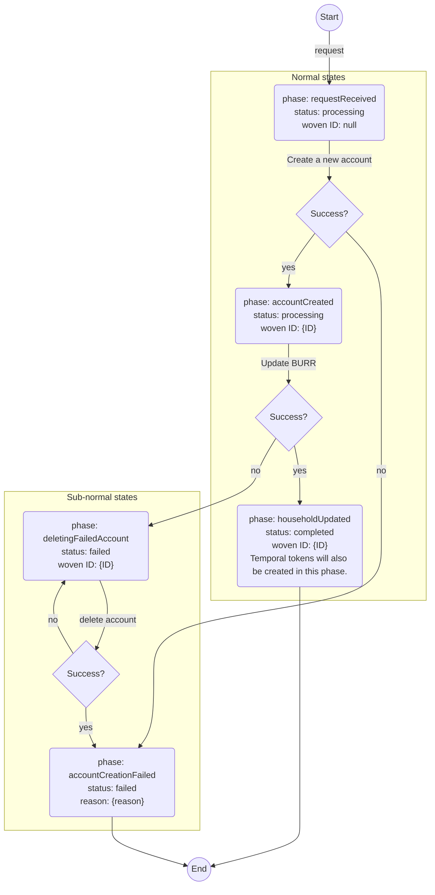

## Sequence Diagram

The following sequences assumes that databases will never be disconnected during request processing.

### Sequence - Register user information (pre-registration method)

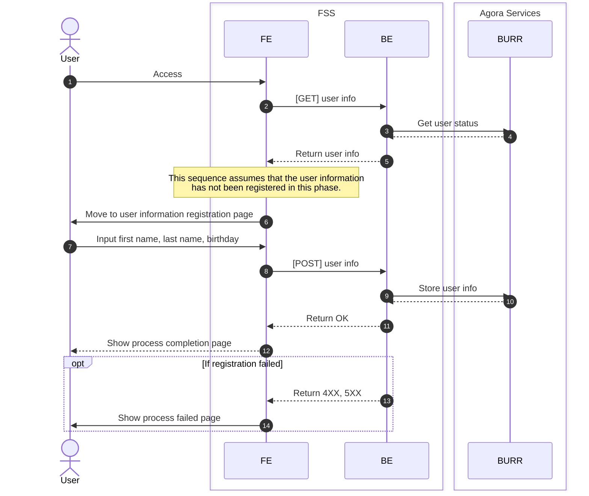

### Sequence - Identity verification (pre-registration method)

#### Access to the application page - complete application (not yet verified)

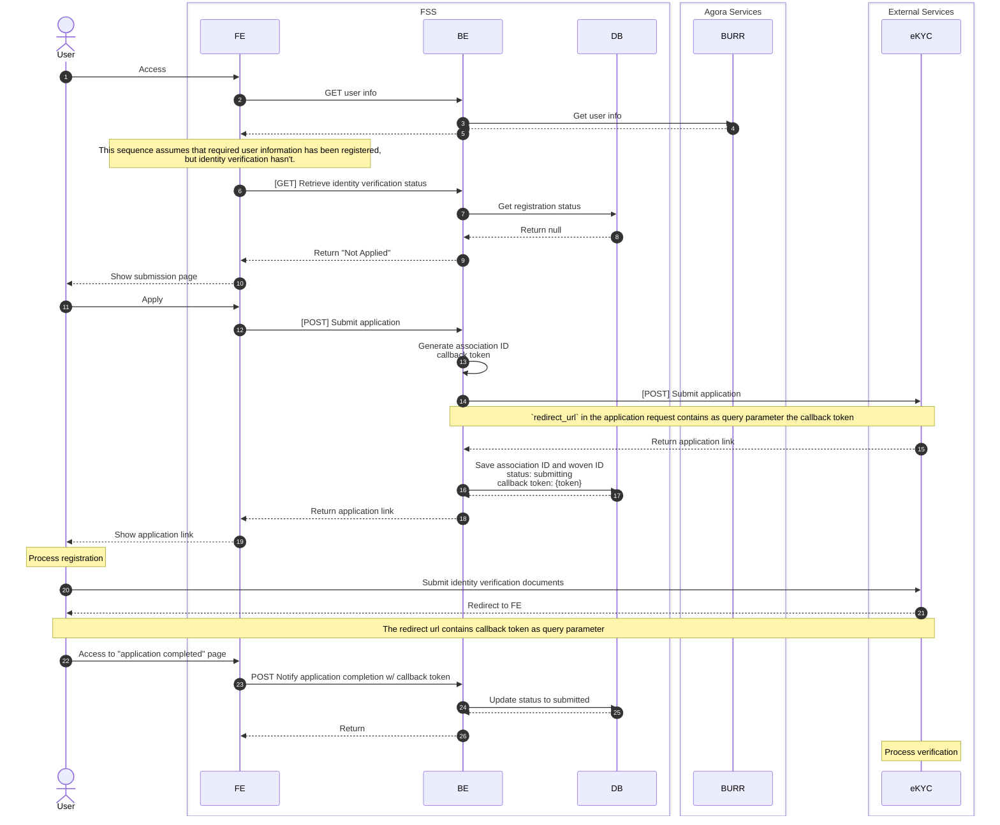

#### Get verification result - Update status

BE periodically calls "GET verification results" API and process results.

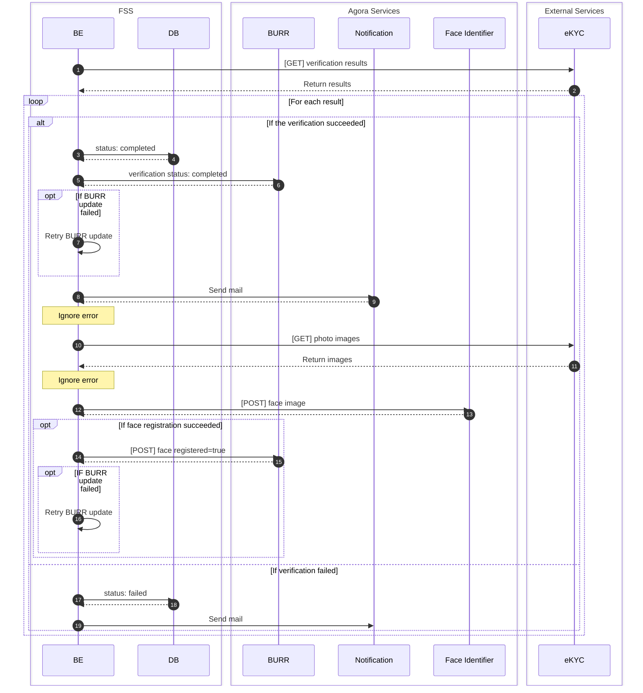

### Sequence - Register additional personal information and face image

This sequence doesn't assume any registration state.
Users can register additional information at any time.

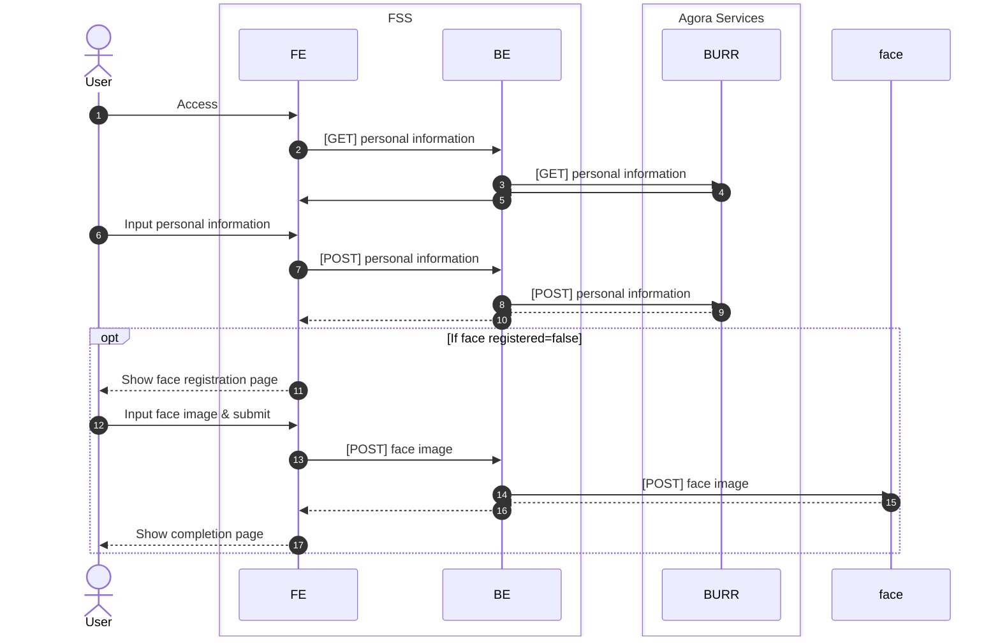

### Sequence - Register children

TODO: follow the current implementation

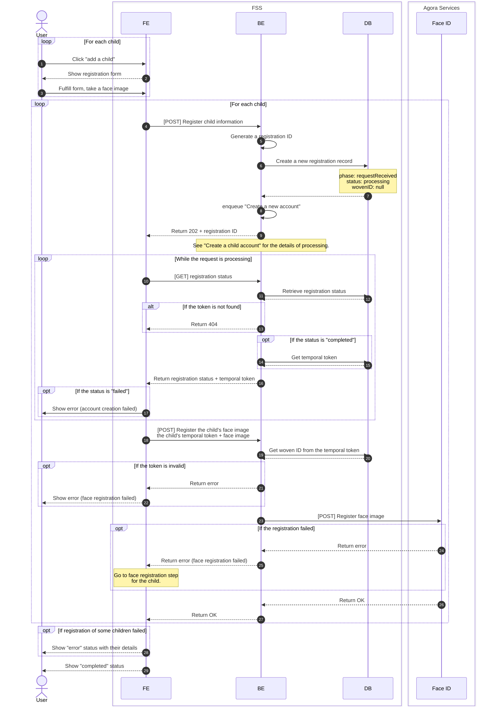

#### Sequence - Create a child account

This is a sub sequence of children registration.

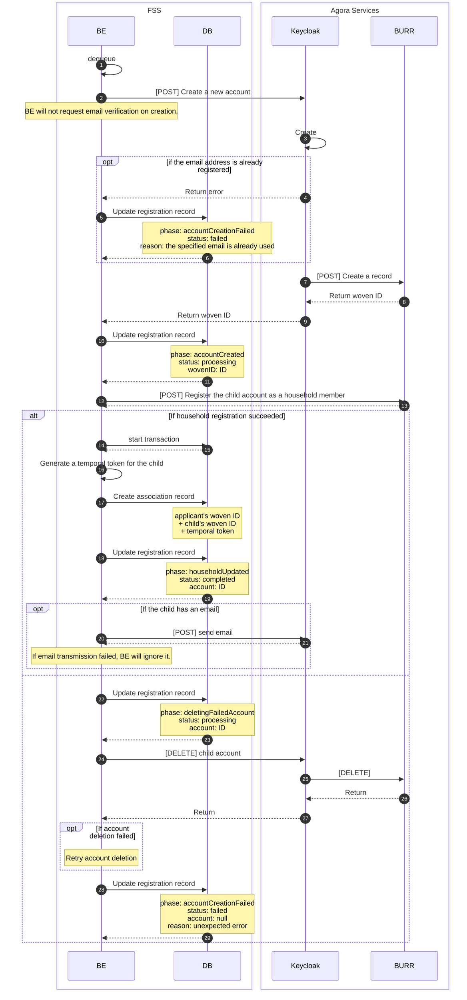

### Sequence - Registration of traffic course completion

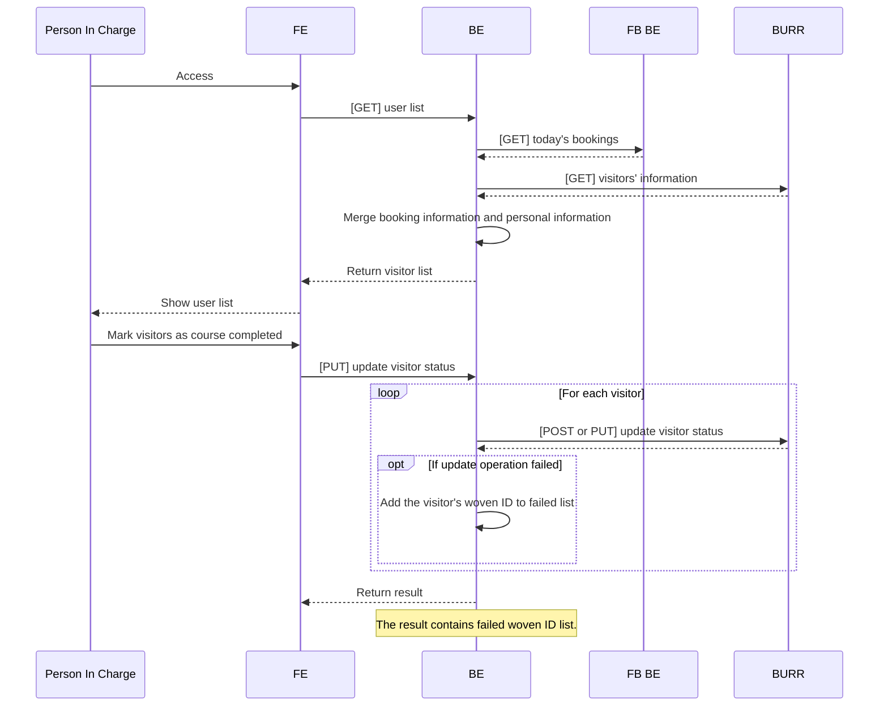
