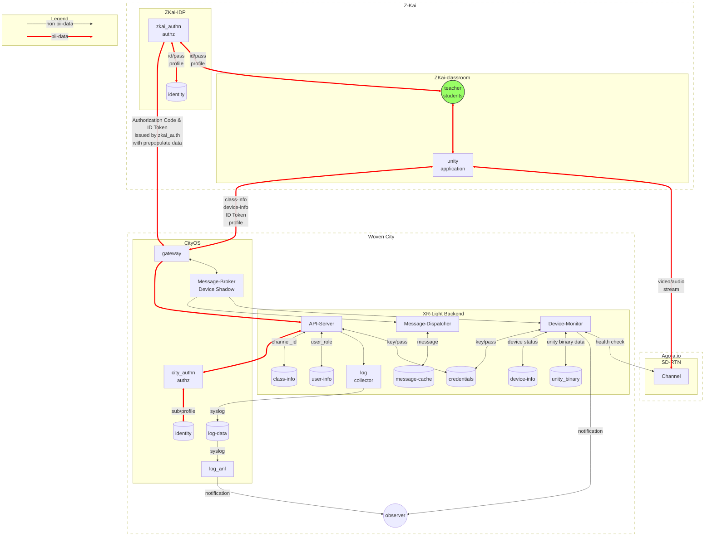

```mermaid
%%{
  init: {
    'theme': 'default',
    'themeVariables': {
        'fontSize': '20px'
    }
  }
}%%

flowchart TD

    user((teacher\nstudents))
    unity[|borders:tb|unity\napplication]
    
    z_auth[|borders:tb|zkai_authn\nauthz]
    z_identity[(identity)]

    observer((observer))
    api[|borders:tb|API-Server]
    dispatcher[|borders:tb|Message-Dispatcher]
    monitor[|borders:tb|Device-Monitor]
    classinfo[(class-info)]
    deviceinfo[(device-info)]
    userinfo[(user-info)]
    messagedata[(message-cache)]
    vault[(credentials)]
    s3_b[(unity_binary)]

    city_auth[|borders:tb|city_authn\nauthz]
    city_identity[(identity)]
    city_broker[|borders:tb|Message-Broker\nDevice Shadow]
    log_proc[|borders:tb|log\ncollector]
    syslog[(log-data)]

    channel[|borders:tb|Channel]

    unity<--class-info\ndevice-info\nID Token\nprofile-->gateway
    unity<--video/audio\nstream-->channel
    z_auth--Authorization Code & ID Token\nissued by zkai_auth\nwith prepopulate data-->gateway

    subgraph woven [Woven City]
        gateway-->api
        gateway<-->city_broker

        api<-->city_auth
        city_broker-->dispatcher
        city_broker-->monitor

        log_anl--notification-->observer

        subgraph xrb [XR-Light Backend]
            api
            dispatcher
            monitor

            api<--channel_id-->classinfo
            api<--user_role-->userinfo
            api-->log_proc
            api<--key/pass-->vault
            
            monitor<--key/pass-->vault
            monitor<--device status-->deviceinfo
            monitor<--unity binary data-->s3_b

            dispatcher<--message-->messagedata

        end
        monitor--notification-->observer

        subgraph cityos [CityOS]
            gateway
            city_auth
            city_identity
            city_broker
            city_auth<--sub/profile-->city_identity
            log_proc--syslog-->syslog
            syslog--syslog-->log_anl
        end
    end

    subgraph zkai [Z-Kai]

        subgraph zkai_u [ZKai-classroom]
            user
            unity
            user<-->unity
        end
        subgraph zkai_idp [ZKai-IDP]
            z_auth
            z_auth<--id/pass\nprofile-->z_identity
        end
        z_auth<--id/pass\nprofile-->user
    end

    subgraph agoraio [Agora.io]
        subgraph sfu [SD-RTN]
            channel
        end
    end

    monitor<--health check-->channel

    classDef boundary fill:none,stroke-dasharray: 10 10
    woven:::boundary
    zkai:::boundary
    agoraio:::boundary

    classDef green fill:#9f6,stroke:#333,stroke-width:2px;
    classDef orange fill:#f96,stroke:#333,stroke-width:4px;
    classDef red stroke:red,stroke-width:4px
    class user green

    subgraph Legend
      direction LR
      start1[ ] --->|non pii-data| stop1[ ]
      style start1 height:0px;
      style stop1 height:0px;
      start2[ ] --->|pii-data| stop2[ ]
      style start2 height:0px;
      style stop2 height:0px;
    end
    
    linkStyle 0 stroke:red,stroke-width:4px
    linkStyle 1 stroke:red,stroke-width:4px
    linkStyle 2 stroke:red,stroke-width:4px
    linkStyle 3 stroke:red,stroke-width:4px
    linkStyle 5 stroke:red,stroke-width:4px
    linkStyle 18 stroke:red,stroke-width:4px
    linkStyle 21 stroke:red,stroke-width:4px
    linkStyle 22 stroke:red,stroke-width:4px
    linkStyle 23 stroke:red,stroke-width:4px
    linkStyle 26 stroke:red,stroke-width:4px

```
