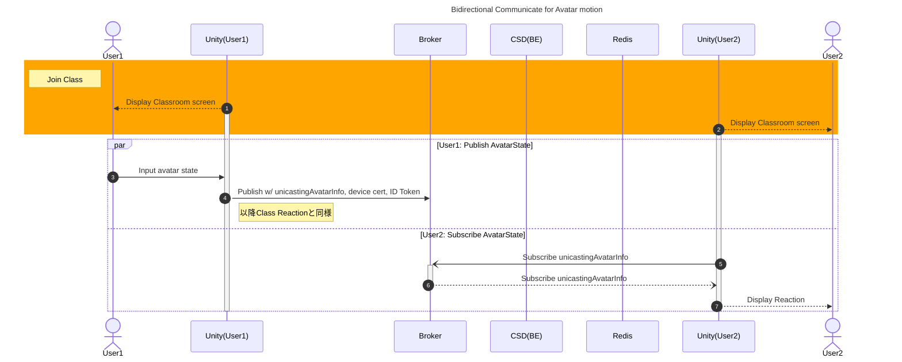

```mermaid
sequenceDiagram
    title Bidirectional Communicate for Avatar motion
    autonumber
    actor User1
    participant Unity1 as Unity(User1)
    participant Broker
    participant CSD as CSD(BE)
    participant Redis
    participant Unity2 as Unity(User2)
    actor User2

    rect rgb(255, 165, 0)
        Note left of User1: Join Class
        Unity1-->>User1: Display Classroom screen
        activate Unity1
        Unity2-->>User2: Display Classroom screen
        activate Unity2
    end

    par User1: Publish AvatarState
        User1->>Unity1: Input avatar state
        
        Unity1->>Broker: Publish w/ unicastingAvatarInfo, device cert, ID Token
        
        Note right of Unity1: 以降Class Reactionと同様

    and User2: Subscribe AvatarState
        Unity2-)+Broker: Subscribe unicastingAvatarInfo
        Broker--)-Unity2: Subscribe unicastingAvatarInfo
        Unity2-->>User2: Display Reaction
    end

    deactivate Unity1
    deactivate Unity2

```
