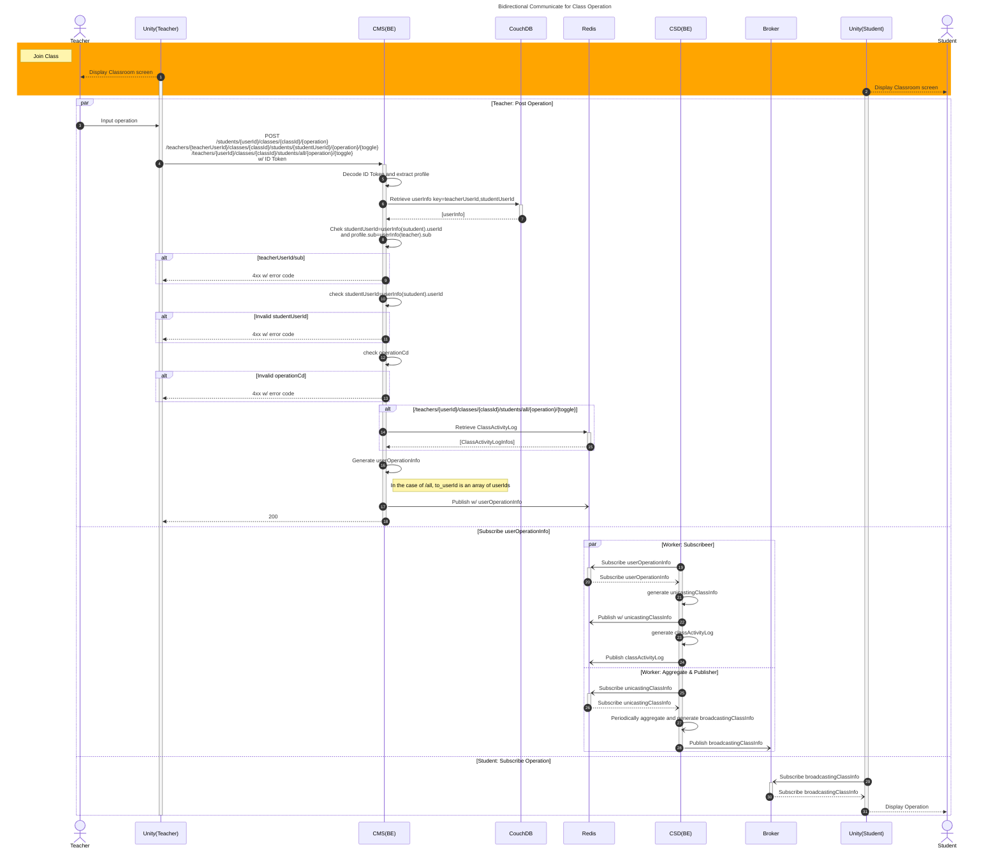

```mermaid
sequenceDiagram
    title Bidirectional Communicate for Class Operation
    autonumber
    actor Teacher as Teacher
    participant UnityT as Unity(Teacher)
    participant CMS as CMS(BE)
    participant DB as CouchDB
    participant Redis
    participant CSD as CSD(BE)
    participant Broker
    participant UnityS as Unity(Student)
    actor Student as Student

    rect rgb(255, 165, 0)
        Note left of Teacher: Join Class
        UnityT-->>Teacher: Display Classroom screen
        activate UnityT
        UnityS-->>Student: Display Classroom screen
        activate UnityS
    end
    
    par Teacher: Post Operation
        Teacher->>UnityT: Input operation
        UnityT->>+CMS: POST<br> /students/{userId}/classes/{classId}/{operation}<br>/teachers/{teacherUserId}/classes/{classId}/students/{studentUserId}/{operation}/{toggle}<br>/teachers/{userId}/classes/{classId}/students/all/{operation}/{toggle}<br> w/ ID Token

        CMS->>CMS: Decode ID Token and extract profile

        CMS->>+DB: Retrieve userInfo key=teacherUserId,studentUserId
        DB-->>-CMS: [userInfo]

        CMS->>CMS: Chek studentUserId=userInfo(sutudent).userId<br>and profile.sub=userInfo(teacher).sub
        alt teacherUserId/sub
            CMS-->>UnityT: 4xx w/ error code
        end

        CMS->>CMS: check studentUserId=userInfo(sutudent).userId
        alt Invalid studentUserId
            CMS-->>UnityT: 4xx w/ error code
        end
        
        CMS->>CMS: check operationCd
        alt Invalid operationCd
            CMS-->>UnityT: 4xx w/ error code
        end

        alt /teachers/{userId}/classes/{classId}/students/all/{operation}/{toggle}
            CMS->>+Redis: Retrieve ClassActivityLog
            Redis-->>-CMS: [ClassActivityLogInfos]
        end

        CMS->>CMS: Generate userOperationInfo
        Note right of CMS: In the case of /all, to_userId is an array of userIds
        CMS-)Redis: Publish w/ userOperationInfo

        CMS-->>-UnityT: 200

    and Subscribe userOperationInfo

        par Worker: Subscribeer
            CSD-)+Redis: Subscribe userOperationInfo
            activate CSD
            Redis--)-CSD: Subscribe userOperationInfo

            CSD->>CSD: generate unicastingClassInfo
            CSD-)Redis: Publish w/ unicastingClassInfo

            CSD->>CSD: generate classActivityLog
            CSD-)Redis: Publish classActivityLog
        and Worker: Aggregate & Publisher
            CSD-)+Redis: Subscribe unicastingClassInfo
            Redis--)-CSD: Subscribe unicastingClassInfo
            CSD-)CSD: Periodically aggregate and generate broadcastingClassInfo
            CSD-)Broker: Publish broadcastingClassInfo
            deactivate CSD
        end
    and Student: Subscribe Operation
        UnityS-)+Broker: Subscribe broadcastingClassInfo
        Broker--)-UnityS: Subscribe broadcastingClassInfo
        UnityS-->>Student: Display Operation
    end

    deactivate UnityT
    deactivate UnityS


```
