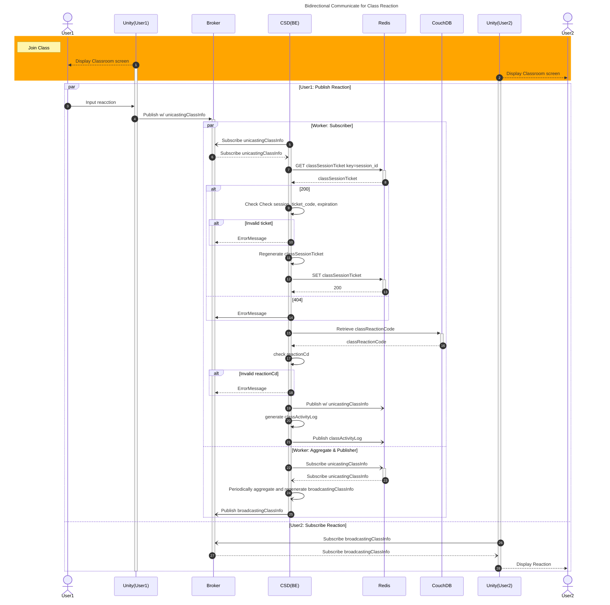

```mermaid
sequenceDiagram
    title Bidirectional Communicate for Class Reaction
    autonumber
    actor User1
    participant Unity1 as Unity(User1)
    participant Broker
    participant CSD as CSD(BE)
    participant Redis
    participant DB as CouchDB
    participant Unity2 as Unity(User2)
    actor User2

    rect rgb(255, 165, 0)
        Note left of User1: Join Class
        Unity1-->>User1: Display Classroom screen
        activate Unity1
        Unity2-->>User2: Display Classroom screen
        activate Unity2
    end
    
    par User1: Publish Reaction
        User1->>Unity1: Input reacction
        Unity1->>+Broker: Publish w/ unicastingClassInfo

        par Worker: Subscriber
            CSD-)Broker: Subscribe unicastingClassInfo
            activate CSD
            Broker--)CSD: Subscribe unicastingClassInfo

            CSD->>+Redis: GET classSessionTicket key=session_id
            Redis-->>-CSD: classSessionTicket
            alt 200
                CSD->>CSD: Check Check session_ticket_code, expiration
                alt Invalid ticket
                    CSD-->>Broker: ErrorMessage
                end
                CSD->>CSD: Regenerate classSessionTicket
                CSD->>+Redis: SET classSessionTicket
                Redis-->>-CSD: 200
            else 404
                CSD ->> Broker: ErrorMessage
            end

            CSD->>+DB: Retrieve classReactionCode
            DB-->>-CSD: classReactionCode
            CSD->>CSD: check reactionCd
            alt Invalid reactionCd
                CSD-->>Broker: ErrorMessage
            end

            CSD-)Redis: Publish w/ unicastingClassInfo

            CSD->>CSD: generate classActivityLog
            CSD-)Redis: Publish classActivityLog

        and Worker: Aggregate & Publisher
            CSD-)+Redis: Subscribe unicastingClassInfo
            Redis--)-CSD: Subscribe unicastingClassInfo
            
            CSD-)CSD: Periodically aggregate and regenerate broadcastingClassInfo
            CSD-)Broker: Publish broadcastingClassInfo
            deactivate CSD
        end

    and User2: Subscribe Reaction
        Unity2-)Broker: Subscribe broadcastingClassInfo
        Broker--)-Unity2: Subscribe broadcastingClassInfo
        Unity2-->>User2: Display Reaction
    end

    deactivate Unity1
    deactivate Unity2

```
