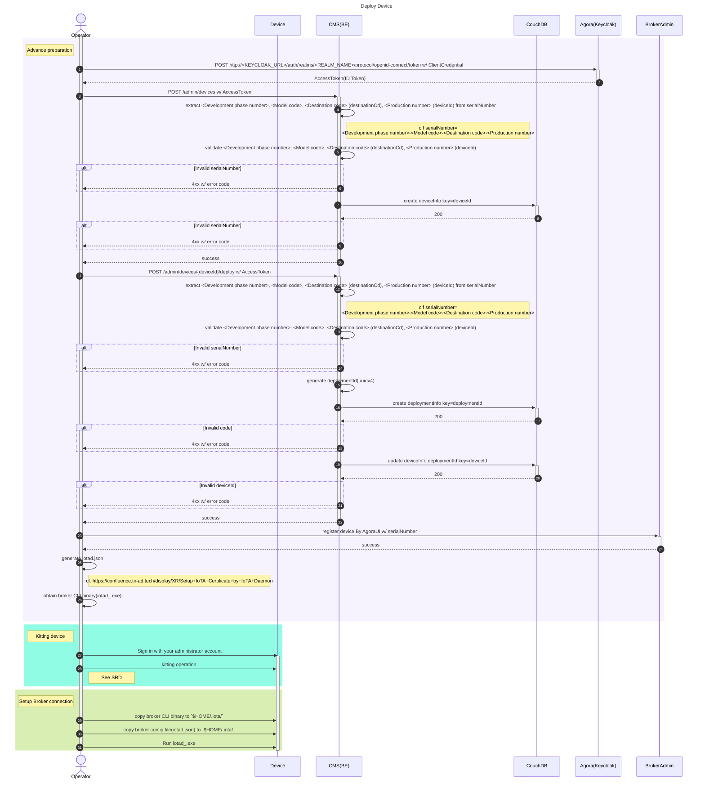

```mermaid
sequenceDiagram
    title Deploy Device
    autonumber
    actor Operator
    participant Device as Device
    participant CMS as CMS(BE)
    participant DB as CouchDB
    participant Keycloak as Agora(Keycloak)
    participant BrokerAdmin as BrokerAdmin

    activate Operator

    rect rgb(246, 243, 255)
        Note left of Operator: Advance preparation
        Operator->>+Keycloak: POST http://<KEYCLOAK_URL>/auth/realms/<REALM_NAME>/protocol/openid-connect/token w/ ClientCredential
        Keycloak-->>-Operator: AccessToken(ID Token)

        Operator->>+CMS: POST /admin/devices w/ AccessToken
        CMS->>CMS: extract <Development phase number>, <Model code>, <Destination code> (destinationCd), <Production number> (deviceId) from serialNumber
        Note right of CMS: c.f serialNumber=<br><Development phase number>-<Model code>-<Destination code>-<Production number>

        CMS->>CMS: validate <Development phase number>, <Model code>, <Destination code> (destinationCd), <Production number> (deviceId)
        alt Invalid serialNumber
            CMS-->>Operator: 4xx w/ error code
        end

        CMS->>+DB: create deviceInfo key=deviceId
        DB-->>-CMS: 200
        alt Invalid serialNumber
            CMS-->>Operator: 4xx w/ error code
        end
        CMS-->>-Operator: success

        Operator->>+CMS: POST /admin/devices/{deviceId}/deploy w/ AccessToken

        CMS->>CMS: extract <Development phase number>, <Model code>, <Destination code> (destinationCd), <Production number> (deviceId) from serialNumber
        Note right of CMS: c.f serialNumber=<br><Development phase number>-<Model code>-<Destination code>-<Production number>

        CMS->>CMS: validate <Development phase number>, <Model code>, <Destination code> (destinationCd), <Production number> (deviceId)
        alt Invalid serialNumber
            CMS-->>Operator: 4xx w/ error code
        end

        CMS->>CMS: generate deploymentId(uuidv4)

        CMS->>+DB: create deploymentInfo key=deploymentId
        DB-->>-CMS: 200
        alt Invalid code
            CMS-->>Operator: 4xx w/ error code
        end

        CMS->>+DB: update deviceInfo.deploymentId key=deviceId
        DB-->>-CMS: 200
        alt Invalid deviceId
            CMS-->>Operator: 4xx w/ error code
        end
        
        CMS-->>-Operator: success

        Operator->>+BrokerAdmin: register device By AgoraUI w/ serialNumber
        BrokerAdmin-->>-Operator: success

        Operator->>Operator: generate iotad.json
        Note right of Operator: cf. https://confluence.tri-ad.tech/display/XR/Setup+IoTA+Certificate+by+IoTA+Daemon
        Operator->>Operator: obtain broker CLI binary(iotad_.exe)
    end

    rect rgb(144, 252, 227)
        Note left of Operator: Kitting device
        Operator->>Device: Sign in with your administrator account
        activate Device
        Operator->>Device: kitting operation
        Note right of Operator: See SRD
    end

    rect rgb(217, 238, 179)
        Note left of Operator: Setup Broker connection
        Operator->>Device: copy broker CLI binary to `$HOME/.iota/`
        Operator->>Device: copy broker config file(iotad.json) to `$HOME/.iota/`
        Operator->>Device: Run iotad_.exe
    end


    deactivate Device
    deactivate Operator


```
