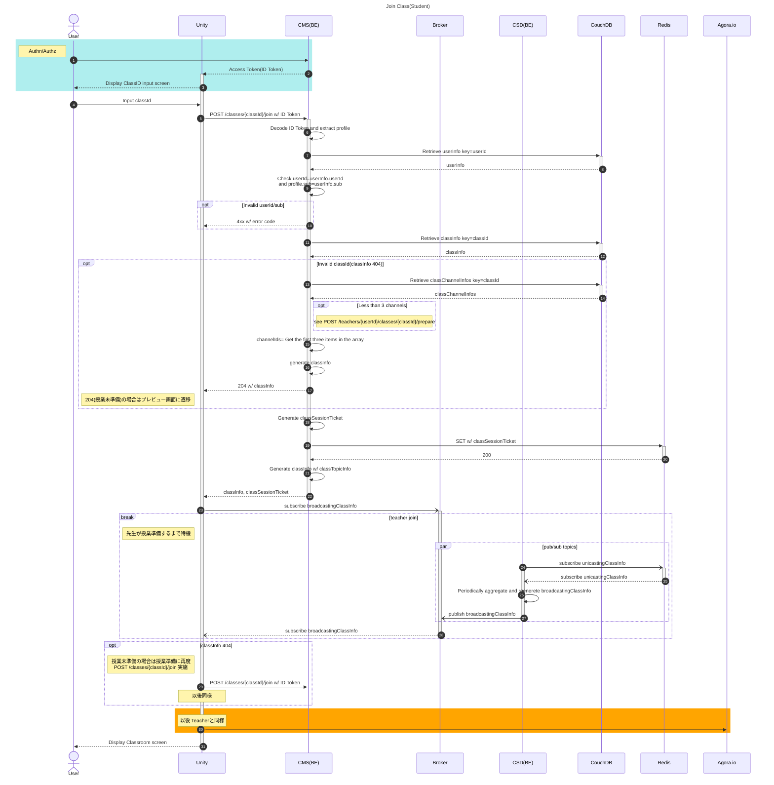

```mermaid
sequenceDiagram
    title Join Class(Student)
    autonumber
    actor User as User
    participant Unity
    participant CMS as CMS(BE)
    participant Broker
    participant CSD as CSD(BE)
    participant DB as CouchDB
    participant Redis
    participant Agoraio as Agora.io

    rect rgb(175, 238, 238)
        Note left of User: Authn/Authz
        User->>CMS: 
        CMS-->>Unity: Access Token(ID Token)
        activate Unity
        Unity-->>User: Display ClassID input screen
    end

    User->>Unity: Input classId

    Unity->>+CMS: POST /classes/{classId}/join w/ ID Token

    CMS->>CMS: Decode ID Token and extract profile
    CMS->>+DB: Retrieve userInfo key=userId
    DB-->>-CMS: userInfo
    CMS->>CMS: Check userId=userInfo.userId<br>and profile.sub=userInfo.sub
    opt Invalid userId/sub
        CMS-->>Unity: 4xx w/ error code
    end

    CMS->>+DB: Retrieve classInfo key=classId
    DB-->>-CMS: classInfo
    opt Invalid classId(classInfo 404)
        CMS->>+DB: Retrieve classChannelInfos key=classId
        DB-->>-CMS: classChannelInfos
        opt Less than 3 channels
            note Right of CMS: see POST /teachers/{userId}/classes/{classId}/prepare
        end
        CMS->>CMS: channelIds= Get the first three items in the array

        CMS->>CMS: generate classInfo

        CMS-->>Unity: 204 w/ classInfo
        Note left of Unity: 204(授業未準備)の場合はプレビュー画面に遷移
    end

    CMS->>CMS: Generate classSessionTicket
    CMS->>+Redis: SET w/ classSessionTicket
    Redis-->>-CMS: 200

    CMS->>CMS: Generate classInfo w/ classTopicInfo
    
    CMS-->>-Unity: classInfo, classSessionTicket

    Unity-)+Broker: subscribe broadcastingClassInfo

    break teacher join
        Note left of Unity: 先生が授業準備するまで待機
        par pub/sub topics
            CSD-)+Redis: subscribe unicastingClassInfo
            activate CSD
            Redis--)-CSD: subscribe unicastingClassInfo
            CSD->>CSD: Periodically aggregate and rgenerete broadcastingClassInfo
            CSD-)Broker: publish broadcastingClassInfo
            deactivate CSD
        end
        Broker--)-Unity: subscribe broadcastingClassInfo
    end

    opt classInfo 404
        Note left of Unity: 授業未準備の場合は授業準備に再度<br>POST /classes/{classId}/join 実施
        Unity->>+CMS: POST /classes/{classId}/join w/ ID Token
        Note over Unity: 以後同様
    end

    rect rgb(255, 165, 0)
        Note over Unity: 以後 Teacherと同様
        Unity->>Agoraio: 
    end

    Unity-->>User: Display Classroom screen

    deactivate Unity


```
