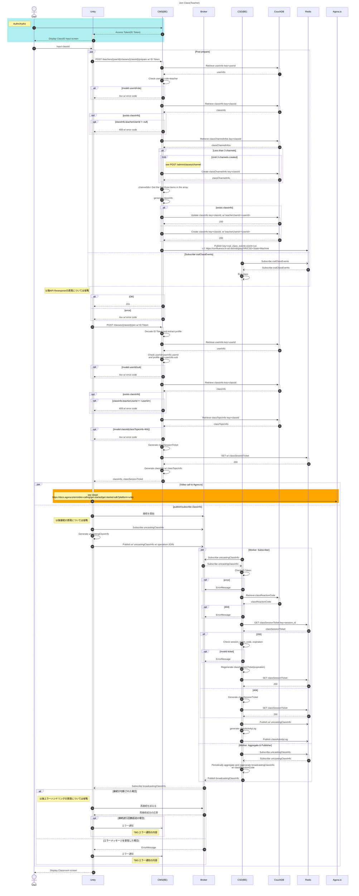

```mermaid
sequenceDiagram
    title Join Class(Teacher)
    autonumber
    actor User as User
    participant Unity
    participant CMS as CMS(BE)
    participant Broker
    participant CSD as CSD(BE)
    participant DB as CouchDB
    participant Redis
    participant Agoraio as Agora.io

    rect rgb(175, 238, 238)
        Note left of User: Authn/Authz
        User->>CMS: 
        CMS-->>Unity: Access Token(ID Token)
        activate Unity
        Unity-->>User: Display ClassID input screen
    end

    User->>Unity: Input classId
    
    par Post prepare
        Unity->>+CMS: POST /teachers/{userId}/classes/{classId}/prepare w/ ID Token

        CMS->>+DB: Retrieve userInfo key=userId
        DB-->>-CMS: userInfo
        CMS->>CMS: Check userInfo.role=teacher
        alt Invalid userId/role
            CMS-->>Unity: 4xx w/ error code
        end

        CMS->>+DB: Retrieve classInfo key=classId
        DB-->>-CMS: classInfo
        opt exists classInfo
            opt classInfo.teacherUserId != null
                CMS-->>Unity: 409 w/ error code
            end
        end

        CMS->>+DB: Retrieve classChannelInfos key=classId
        DB-->>-CMS: classChannelInfos
        alt Less than 3 channels
            loop Until 3 channels created
                note Right of CMS: see POST /admin/classes/channel
                CMS->>+DB: Create classChannelInfo key=classId
                DB-->>-CMS: classChannelInfo
            end
        end
        CMS->>CMS: channelIds= Get the first three items in the array

        CMS->>CMS: generate classInfo


        alt exists classInfo
            CMS->>+DB: Update classInfo key=classId, w/ teacherUserId=<userId>
            DB-->>-CMS: 200
        else
            CMS->>+DB: Create classInfo key=classId, w/ teacherUserId=<userId>
            DB-->>-CMS: 200
        end


        CMS->>Redis: Publish key=csd_class_events event=run <br> c.f. https://confluence.tri-ad.tech/display/XR/CSD+State+Machine

    and Subscribe csdClassEvents
        CSD-)Redis: Subscribe csdClassEvents
        activate CSD
        Redis--)CSD: Subscribe csdClassEvents
        CSD-)CSD: Run class

        deactivate CSD
    end

    note left of Unity: 以後API Resesposeの表現については省略
    alt OK
        CMS-->>Unity: 201
    else error
        CMS-->>-Unity: 4xx w/ error code
    end

    Unity->>+CMS: POST /classes/{classId}/join w/ ID Token

    CMS->>CMS: Decode ID Token and extract profile
    CMS->>+DB: Retrieve userInfo key=userId
    DB-->>-CMS: userInfo
    CMS->>CMS: Check userId=userInfo.userId<br>and profile.sub=userInfo.sub
    opt Invalid userId/sub
        CMS-->>Unity: 4xx w/ error code
    end


    CMS->>+DB: Retrieve classInfo key=classId
    DB-->>-CMS: classInfo
    opt exists classInfo
        opt classInfo.teacherUserId != <userId>
            CMS-->>Unity: 409 w/ error code
        end
    end


    CMS->>+DB: Retrieve classTopicInfo key=classId
    DB-->>-CMS: classTopicInfo
    opt Invalid classId(classTopicInfo 404)
        CMS-->>Unity: 4xx w/ error code
    end

    CMS->>CMS: Generate classSessionTicket
    CMS->>+Redis: SET w/ classSessionTicket
    Redis-->>-CMS: 200

    CMS->>CMS: Generate classInfo w/ classTopicInfo
    CMS-->>-Unity: classInfo, classSessionTicket

    par Video call to Agora.io
        rect rgb(255, 165, 0)
            Note over Unity: see detail:<br>https://docs.agora.io/en/video-calling/get-started/get-started-sdk?platform=unity#implement-the-channel-logic>
            Unity->>Agoraio: 
        end
    and publish/subscribe classInfo

        Unity->>Broker: 接続を開始
        activate Broker
        note left of Unity: 以後接続の表現については省略
        
        Unity-)Broker: Subscribe unicastingClassInfo
        Unity->>Unity: Generate unicastingClassInfo
        Unity-)Broker: Publish w/ unicastingClassInfo w/ operation=JOIN
        
        par Worker: Subscriber
            CSD-)Broker: Subscribe unicastingClassInfo
            activate CSD
            Broker--)CSD: Subscribe unicastingClassInfo
            
            CSD->>CSD: Check ID Token
            opt error
                CSD ->> Broker: ErrorMessage
            end

            CSD->>+DB: Retrieve classReactionCode
            DB-->>-CSD: classReactionCode
            opt 404
                CSD-->>Broker: ErrorMessage
            end

            CSD->>+Redis: GET classSessionTicket key=session_id
            Redis-->>-CSD: classSessionTicket
            alt 200
                CSD->>CSD: Check session_ticket_code, expiration
                opt Invalid ticket
                    CSD-->>Broker: ErrorMessage
                end
                CSD->>CSD: Regenerate classSessionTicket(expiration)
                CSD->>+Redis: SET classSessionTicket
                Redis-->>-CSD: 200
            else 404
                CSD->>CSD: Generate classSessionTicket
                CSD->>+Redis: SET classSessionTicket
                Redis-->>-CSD: 200
            end

            CSD-)Redis: Publish w/ unicastingClassInfo

            CSD->>CSD: generate classActivityLog
            CSD-)Redis: Publish classActivityLog

        and Worker: Aggregate & Publisher
            CSD-)+Redis: Subscribe unicastingClassInfo
            Redis--)-CSD: Subscribe unicastingClassInfo
            
            CSD-)CSD: Periodically aggregate and regenerate broadcastingClassInfo<br>w/ classReactionCode
            CSD--)-Broker: Publish broadcastingClassInfo
        end

        Broker--)Unity: Subscribe broadcastingClassInfo

        alt 接続が切断された場合
            note left of Unity: 以後エラーハンドリングの表現については省略
            Unity ->> Broker: 再接続を試みる
            Broker -->> Unity: 再接続成功の応答
            opt 接続試行回数超過の場合
                Unity -x CMS: エラー通知
                note left of CMS: TBD:エラー通知の内容
            end
        else エラーメッセージを受信した場合
            Broker -->> Unity: ErrorMessage
            deactivate Broker
            Unity -x CMS: エラー通知
            note left of CMS: TBD:エラー通知の内容
        end
        
    end
    Unity-->>User: Display Classroom screen

    deactivate Unity


```
