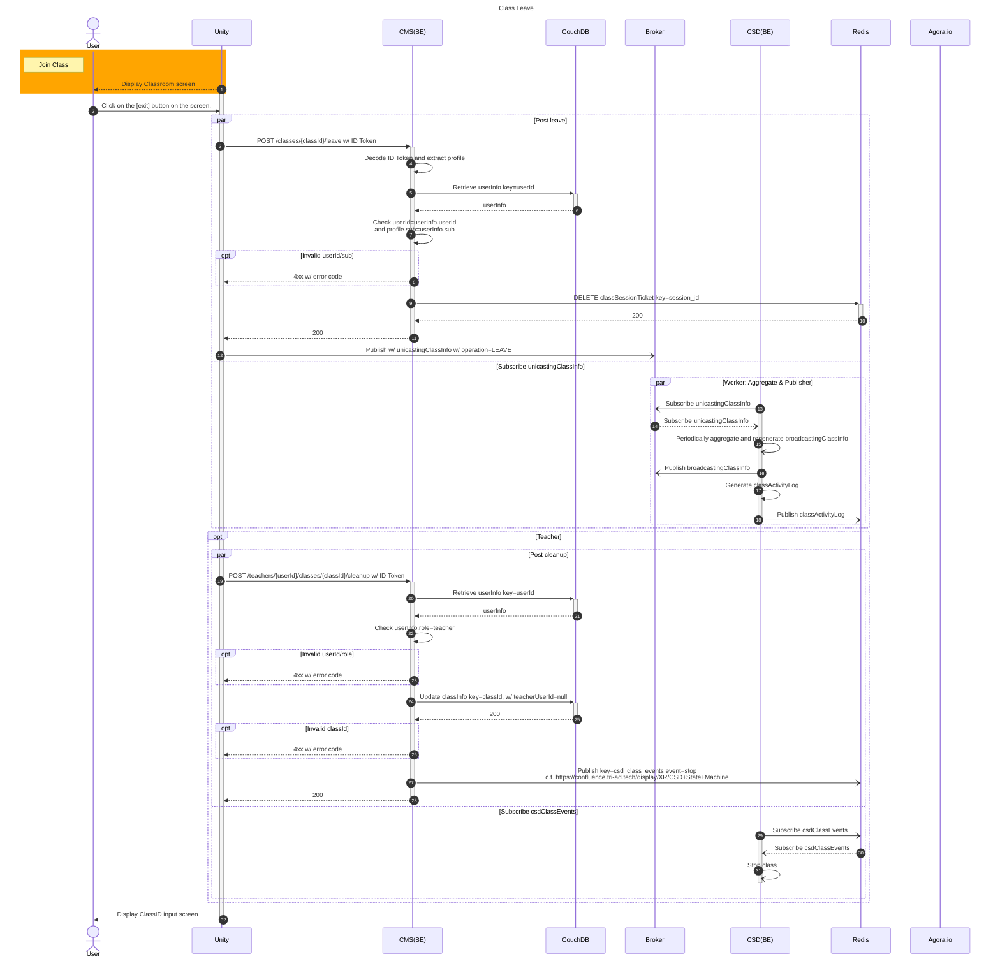

```mermaid
sequenceDiagram
    title Class Leave
    autonumber
    actor User
    participant Unity
    participant CMS as CMS(BE)
    participant DB as CouchDB
    participant Broker
    participant CSD as CSD(BE)
    participant Redis
    participant Agoraio as Agora.io

    rect rgb(255, 165, 0)
        Note left of User: Join Class
        Unity-->>User: Display Classroom screen
        activate Unity
    end
    
    User->>Unity: Click on the [exit] button on the screen.

    par Post leave
        Unity->>+CMS: POST /classes/{classId}/leave w/ ID Token

        CMS->>CMS: Decode ID Token and extract profile
        CMS->>+DB: Retrieve userInfo key=userId
        DB-->>-CMS: userInfo
        CMS->>CMS: Check userId=userInfo.userId<br>and profile.sub=userInfo.sub
        opt Invalid userId/sub
            CMS-->>Unity: 4xx w/ error code
        end

        CMS->>+Redis: DELETE classSessionTicket key=session_id
        Redis-->>-CMS: 200

        CMS-->>-Unity: 200

        Unity-)Broker: Publish w/ unicastingClassInfo w/ operation=LEAVE

    and Subscribe unicastingClassInfo
        par Worker: Aggregate & Publisher
            CSD-)Broker: Subscribe unicastingClassInfo
            activate CSD
            Broker--)CSD: Subscribe unicastingClassInfo

            CSD-)CSD: Periodically aggregate and regenerate broadcastingClassInfo
            
            CSD-)Broker: Publish broadcastingClassInfo
            activate Broker

            CSD->>CSD: Generate classActivityLog
            CSD-)Redis: Publish classActivityLog
            deactivate CSD
        end
    end
    

    opt Teacher
        par Post cleanup
            Unity->>+CMS: POST /teachers/{userId}/classes/{classId}/cleanup w/ ID Token

            CMS->>+DB: Retrieve userInfo key=userId
            DB-->>-CMS: userInfo
            CMS->>CMS: Check userInfo.role=teacher
            opt Invalid userId/role
                CMS-->>Unity: 4xx w/ error code
            end
            
            CMS->>+DB: Update classInfo key=classId, w/ teacherUserId=null
            DB-->>-CMS: 200
            opt Invalid classId
                CMS-->>Unity: 4xx w/ error code
            end

            CMS-)Redis: Publish key=csd_class_events event=stop <br> c.f. https://confluence.tri-ad.tech/display/XR/CSD+State+Machine

            CMS-->>-Unity: 200

        and Subscribe csdClassEvents
            CSD-)Redis: Subscribe csdClassEvents
            activate CSD
            Redis--)CSD: Subscribe csdClassEvents
            CSD-)CSD: Stop class

            deactivate CSD
        end
    end

    Unity-->>User: Display ClassID input screen

    deactivate Unity


```
