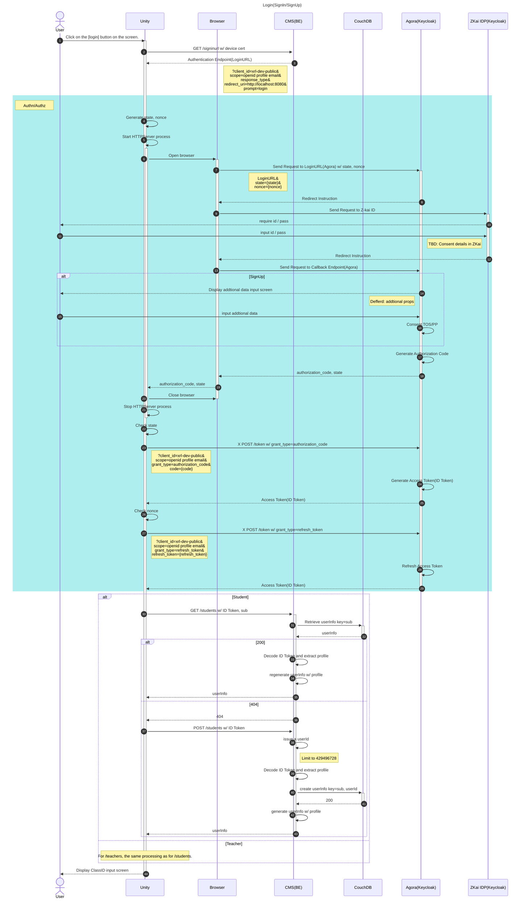

```mermaid
sequenceDiagram
    title Login(SignIn/SignUp)
    autonumber
    actor User as User
    participant Unity
    participant Browser
    participant CMS as CMS(BE)
    participant DB as CouchDB
    participant Keycloak as Agora(Keycloak)
    participant ZIDP as ZKai IDP(Keycloak)

        User->>Unity: Click on the [login] button on the screen.
        activate Unity
        Unity->>+CMS: GET /signinurl w/ device cert
        CMS-->>Unity: Authentication Endpoint(LoginURL)
        note left of CMS: ?client_id=xrl-dev-public&<br>scope=openid profile email&<br>response_type&<br>redirect_uri=http://localhost:8080&<br>prompt=login
    rect rgb(175, 238, 238)
        Note left of User: Authn/Authz
        Unity->>Unity: Generate state, nonce
        
        Unity->>+Unity: Start HTTPServer process
        Unity->>+Browser: Open browser
        Browser->>+Keycloak: Send Request to LoginURL(Agora) w/ state, nonce
        note left of CMS: LoginURL&<br>state={state}&<br>nonce={nonce}
        Keycloak-->>Browser: Redirect Instruction
        Browser->>+ZIDP: Send Request to Z-kai ID
        ZIDP-->>User: require id / pass
        User->>ZIDP: input id / pass
        note right of Keycloak: TBD: Consent details in ZKai
        ZIDP-->>-Browser: Redirect Instruction
        Browser->>Keycloak: Send Request to Callback Endpoint(Agora)
        alt SignUp
            Keycloak-->>User: Display addtional data input screen
            note left of Keycloak: Defferd: addtional props
            User->>Keycloak: input addtional data
            Keycloak->>Keycloak: Consent TOS/PP
        end
        Keycloak->>Keycloak: Generate Authorization Code
        Keycloak-->>Browser: authorization_code, state
        Browser-->>Unity: authorization_code, state
        Unity->>Browser: Close browser
        deactivate Browser
        Unity->>Unity: Stop HTTPServer process
        deactivate Unity

        Unity->>Unity: Check state
        Unity->>Keycloak: X POST /token w/ grant_type=authorization_code
        note right of Unity: ?client_id=xrl-dev-public&<br>scope=openid profile email&<br>grant_type=authorization_code&<br>code={code}
        Keycloak->>Keycloak: Generate Access Token(ID Token)
        Keycloak-->>Unity: Access Token(ID Token)
        Unity->>Unity: Check nonce
        Unity->>Keycloak: X POST /token w/ grant_type=refresh_token
        note right of Unity: ?client_id=xrl-dev-public&<br>scope=openid profile email&<br>grant_type=refresh_token&<br>refresh_token={refresh_token}
        Keycloak->>Keycloak: Refresh Access Token
        Keycloak-->>-Unity: Access Token(ID Token)
    end
    alt Student
        Unity->>+CMS: GET /students w/ ID Token, sub
        CMS->>+DB: Retrieve userInfo key=sub
        DB-->>-CMS: userInfo
        alt 200
            CMS->>CMS: Decode ID Token and extract profile
            CMS->>CMS: regenerate userInfo w/ profile
            CMS-->>Unity: userInfo
        else 404
            CMS-->>Unity: 404
            Unity->>CMS: POST /students w/ ID Token
            CMS->>CMS: issue a userId
            Note right of CMS: Limit to 429496728
            CMS->>CMS: Decode ID Token and extract profile
            CMS->>+DB: create userInfo key=sub, userId
            DB-->>-CMS: 200
            CMS->>CMS: generate userInfo w/ profile
            CMS-->>-Unity: userInfo
        end
    else Teacher
        Note over Unity: For /teachers, the same processing as for /students.
    end
    Unity-->>-User: Display ClassID input screen


```
