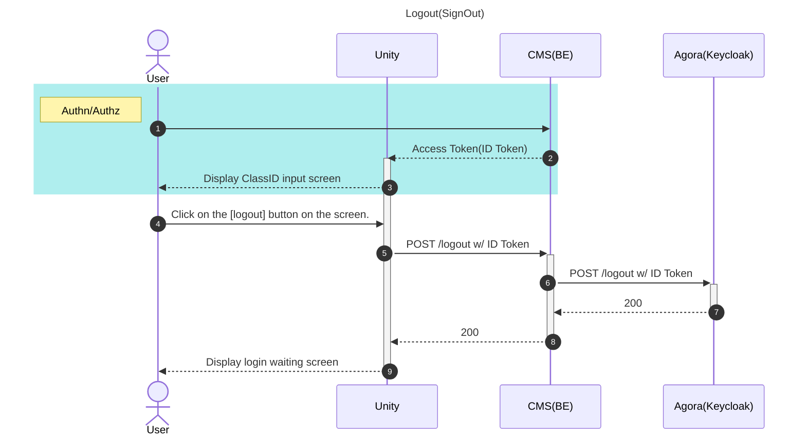

```mermaid
sequenceDiagram
    title Logout(SignOut)
    autonumber
    actor User
    participant Unity
    participant CMS as CMS(BE)
    participant Keycloak as Agora(Keycloak)

    rect rgb(175, 238, 238)
        Note left of User: Authn/Authz
        User->>CMS: 
        CMS-->>Unity: Access Token(ID Token)
        activate Unity
        Unity-->>User: Display ClassID input screen
    end
    
    User->>Unity: Click on the [logout] button on the screen.
    Unity->>+CMS: POST /logout w/ ID Token
    CMS->>+Keycloak: POST /logout w/ ID Token
    Keycloak-->>-CMS: 200
    CMS-->>-Unity: 200

    Unity-->>User: Display login waiting screen

    deactivate Unity

```
