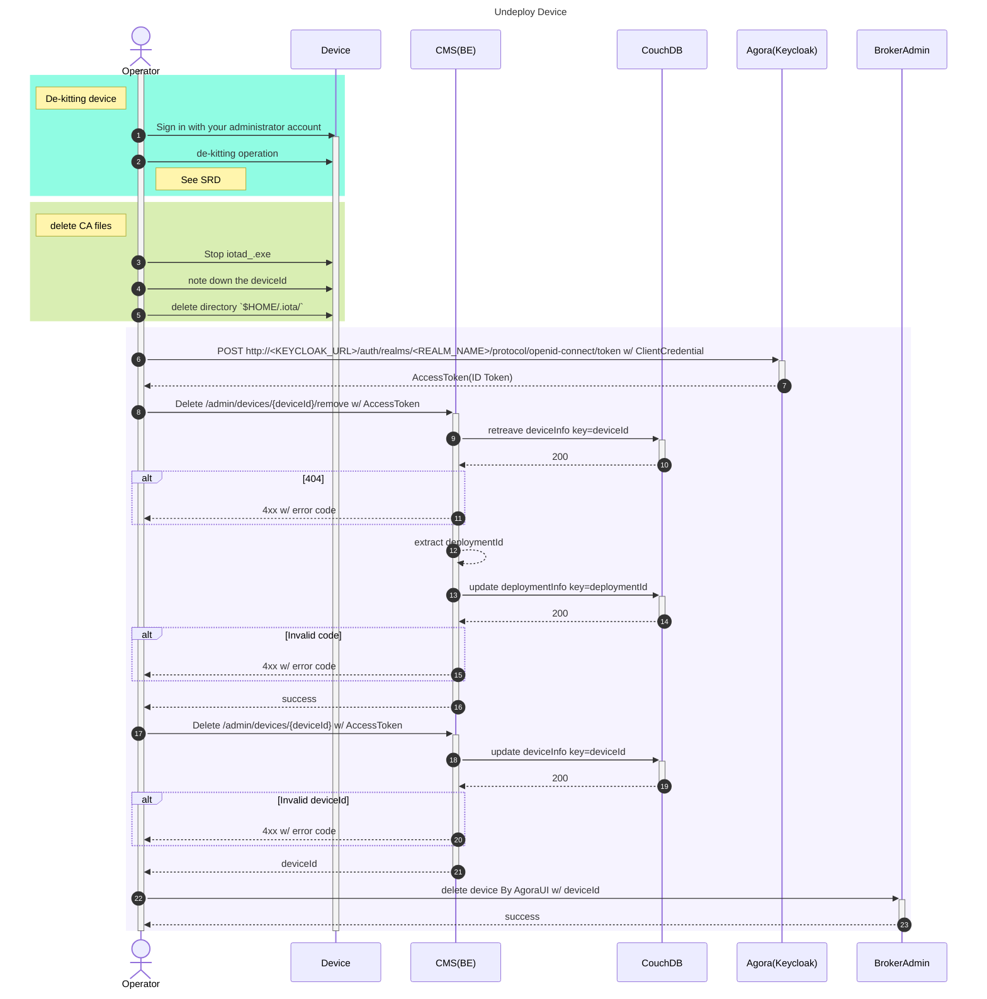

```mermaid
sequenceDiagram
    title Undeploy Device
    autonumber
    actor Operator
    participant Device as Device
    participant CMS as CMS(BE)
    participant DB as CouchDB
    participant Keycloak as Agora(Keycloak)
    participant BrokerAdmin as BrokerAdmin

    activate Operator

    rect rgb(144, 252, 227)
        Note left of Operator: De-kitting device
        Operator->>Device: Sign in with your administrator account
        activate Device
        Operator->>Device: de-kitting operation
        Note right of Operator: See SRD
    end

    rect rgb(217, 238, 179)
        Note left of Operator: delete CA files
        Operator->>Device: Stop iotad_.exe
        Operator->>Device: note down the deviceId
        Operator->>Device: delete directory `$HOME/.iota/`
    end

    rect rgb(246, 243, 255)
        Operator->>+Keycloak: POST http://<KEYCLOAK_URL>/auth/realms/<REALM_NAME>/protocol/openid-connect/token w/ ClientCredential
        Keycloak-->>-Operator: AccessToken(ID Token)

        Operator->>+CMS: Delete /admin/devices/{deviceId}/remove w/ AccessToken

        CMS->>+DB: retreave deviceInfo key=deviceId
        DB-->>-CMS: 200
        alt 404
            CMS-->>Operator: 4xx w/ error code
        end
        CMS-->>CMS: extract deploymentId

        CMS->>+DB: update deploymentInfo key=deploymentId
        DB-->>-CMS: 200
        alt Invalid code
            CMS-->>Operator: 4xx w/ error code
        end
        CMS-->>-Operator: success

        Operator->>+CMS: Delete /admin/devices/{deviceId} w/ AccessToken
        CMS->>+DB: update deviceInfo key=deviceId
        DB-->>-CMS: 200
        alt Invalid deviceId
            CMS-->>Operator: 4xx w/ error code
        end
        CMS-->>-Operator: deviceId

        Operator->>+BrokerAdmin: delete device By AgoraUI w/ deviceId
        BrokerAdmin-->>-Operator: success
    end

    deactivate Device
    deactivate Operator


```
