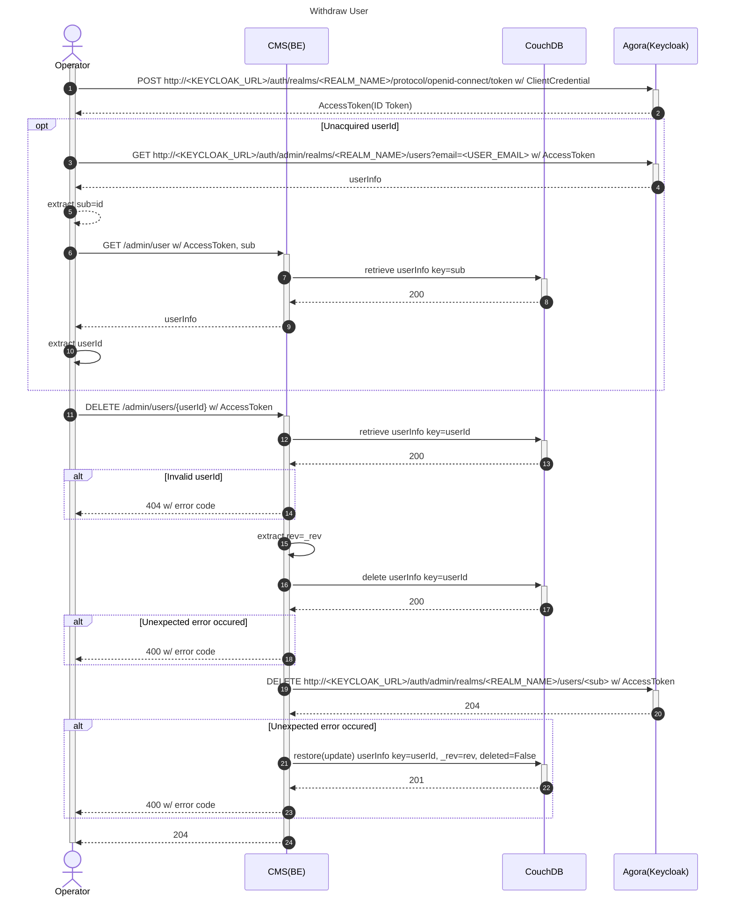

```mermaid
sequenceDiagram
    title Withdraw User
    autonumber
    actor Operator
    participant CMS as CMS(BE)
    participant DB as CouchDB
    participant Keycloak as Agora(Keycloak)

    activate Operator
    Operator->>+Keycloak: POST http://<KEYCLOAK_URL>/auth/realms/<REALM_NAME>/protocol/openid-connect/token w/ ClientCredential
    Keycloak-->>-Operator: AccessToken(ID Token)
    
    opt Unacquired userId
        Operator->>+Keycloak: GET http://<KEYCLOAK_URL>/auth/admin/realms/<REALM_NAME>/users?email=<USER_EMAIL> w/ AccessToken
        Keycloak-->>-Operator: userInfo

        Operator-->>Operator: extract sub=id

        Operator->>+CMS: GET /admin/user w/ AccessToken, sub
        CMS->>+DB: retrieve userInfo key=sub
        DB-->>-CMS: 200
        CMS-->>-Operator: userInfo

        Operator->>Operator: extract userId
    end

    Operator->>+CMS: DELETE /admin/users/{userId} w/ AccessToken


    CMS->>+DB: retrieve userInfo key=userId
    DB-->>-CMS: 200
    alt Invalid userId
        CMS-->>Operator: 404 w/ error code
    end

    CMS->>CMS: extract rev=_rev

    CMS->>+DB: delete userInfo key=userId
    DB-->>-CMS: 200
    alt Unexpected error occured
        CMS-->>Operator: 400 w/ error code
    end

    CMS->>+Keycloak: DELETE http://<KEYCLOAK_URL>/auth/admin/realms/<REALM_NAME>/users/<sub> w/ AccessToken
    Keycloak-->>-CMS: 204

    alt Unexpected error occured
        CMS->>+DB: restore(update) userInfo key=userId, _rev=rev, deleted=False
        DB-->>-CMS: 201
        CMS-->>Operator: 400 w/ error code
    end

    CMS-->>-Operator: 204

    deactivate Operator


```
